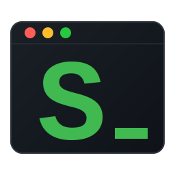

<div align="center">
  
  <h1>Staging</h1>
  <p>
    <strong>A visual review interface for headless AI coding agents.</strong><br>
    Review staged changes, visualize diffs, and provide inline feedback.
  </p>
</div>

---

## What is Staging?

**Staging** is a complementary tool designed to enhance agentic coding workflows by providing visual diff review capabilities that terminal-based and IDE-constrained AI coding tools currently lack.

Modern AI coding agents (Claude Code, Gemini CLI, Cursor, and similar tools) excel at generating code changes, but reviewing those changes often happens in limited environments:
- **CLI agents** display diffs in the terminal, making it difficult to review multi-file refactors
- **VSCode extensions** are constrained by the IDE's diff viewer, which lacks persistent review states and inline commenting

Staging fills this gap by launching a dedicated browser-based review interface with GitHub-style diffs, inline comments, and comprehensive change visualization—bridging the final step between AI-generated code and confident commits.

## Why Staging?

When working with AI coding agents in production environments, you need:
- **Clear visibility** into multi-file changes across your codebase
- **Structured review** with side-by-side or unified diff views
- **Feedback loops** to communicate refinements back to your agent
- **Confidence** before committing agent-generated code

Staging provides a lightweight, local-first review layer that complements your existing agentic coding setup without replacing any tools in your workflow.

## Features

- **Private & Lightweight**: Runs 100% locally. No internet connection required. Zero telemetry.
- **GitHub-Style Diffs**: Split and unified diff views with syntax highlighting
- **Inline Comments**: Add threaded comments directly on changed lines to guide agent refinements
- **Multi-Project Support**: Navigate between sibling repositories and git worktrees
- **Hunk-Level Actions**: Unstage or revert individual hunks directly from the diff view
- **File Tree Navigation**: Flat list or collapsible tree view with fuzzy search
- **Markdown/HTML Preview**: Toggle per-file between diff and rendered preview for `.md` and `.html` files, with selection-based commenting on the rendered output
- **Theme Support**: Light and dark modes with system preference detection

## Integration with AI Coding Agents

Staging integrates seamlessly with any terminal-based coding agent. Simply add an instruction to your agent's configuration to run `staging` after completing tasks.

### Example: Claude Code Integration

Add this to your `.claude/CLAUDE.md` file:

```markdown
## Task Completion Protocol

After completing any implementation task:
1. Stage all changes with `git add .`
2. Run `staging` to launch the visual human review interface
3. Wait for user review and feedback before proceeding
```

Now, when Claude finishes a task, it will automatically launch Staging in your browser for visual review.

## Quick Start

**1. Install**
```bash
git clone https://github.com/barryyosi/staging
cd staging
npm install
npm link
```

**2. Workflow**
```
1. Let your coding agent introduce some changes.
2. Either of you can stage the changes with `git add .`
3. Either of you can launch visual review with `staging`
```

The browser will open automatically at `http://localhost:3456` with your staged changes ready for review.

## Tech Stack

| Layer | Technologies |
| :--- | :--- |
| **Frontend** | React 19, Vite, Vanilla CSS |
| **Backend** | Node.js, Hono, ESM |
| **CLI** | Native Node.js executable |

---

<div align="center">
  <sub>Built for developers who pair program with AI agents and need production-grade code review workflows.</sub>
</div>
