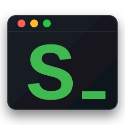

<div align="center">
  
  <h1>Staging</h1>
  <p>
    <strong>A complementary code review tool for AI coding agents.</strong><br>
    Review staged changes, visualize diffs, and provide inline feedback—right in your browser.
  </p>
</div>

---

**Staging** It's the first Human-In-The-Loop (HITL) layer for modern AI-assisted development—a review checkpoint that plugs into the agents you already use.

AI coding agents like Claude Code, Gemini CLI, Roo Code, and others are great at generating code—but reviewing their output is a different story. Diffs in a terminal are hard to parse, and IDE diff viewers lack persistent review states and inline commenting. You end up squinting at changes and hoping nothing slipped through.

Staging gives you a dedicated, browser-based review interface with GitHub-style diffs and inline comments. Your agent makes the changes, Staging lets you actually review them before you commit.

## Features

- **Private & Lightweight**: Runs locally with zero telemetry. The diff viewer needs no internet at all; the only outbound traffic is git talking to your remote (update check) and, if installed, your own `gh` / `glab` / `az` CLI looking up the open pull request for your branch. Both can be switched off in config.
- **Multi-Project Support**: Navigate between sibling repositories and git worktrees
- **Inline Comments**: Add threaded comments directly on changed lines to guide agent refinements; drag the `+` gutter button to comment on a range of lines
- **Markdown/HTML Preview**: Toggle per-file between diff and rendered preview for `.md` and `.html` files, with inline commenting on the rendered output — hover any block for a `+` gutter button, or select text to quote it; comments carry the markdown source line so the agent knows exactly where to edit
- **Standalone File Preview**: Point staging at a single markdown/HTML file — no git repo needed — for a live-reloading rendered preview with the same inline commenting, plus file-level comments, a general review note, and the comments panel
- **Review State That Survives a Reopen**: Comments, the general note and the files you marked reviewed are kept in the browser per repository. Reopen staging after the agent has worked and the files whose diff did not change are still ticked; comments on files that did change come back as stale, listed in the panel for reference but not sent again
- **Compare Against a Base Branch**: Switch the review from "what is staged" to "everything this branch adds on top of `main`" (or any branch) — committed and staged alike — from the header, `--base <branch>`, or the `baseBranch` config option
- **Pull Request Aware**: When the checked-out branch has an open pull/merge request (GitHub via `gh`, GitLab via `glab`, Azure DevOps via `az`), the compare picker offers its target branch and the handoff names the request; run `staging --pr` to open the review on the whole request instead of the staged diff — review the PR locally, send the comments straight to the agent
- **Update Release Notes**: When a newer Staging build is available, the app opens a built-in "What's New" modal showing the running and available versions (with their commits) and every changelog entry since your version before updating

## Tech Stack

| Layer | Technologies |
| :--- | :--- |
| **Frontend** | React 19, Vite, Lucide, Vanilla CSS |
| **Backend** | Node.js, Hono, ESM |
| **CLI** | Native Node.js executable |


## Quick Start

```bash
git clone https://github.com/barryyosi/staging
cd staging
npm install
npm link
```

Usage:
1. Stage changes: `git add [CHANGED_FILES]`
2. Run `staging`
3. Review at `http://localhost:3456`

### Comparing Against a Base Branch

By default Staging reviews the staged diff (index vs `HEAD`). To review the
whole branch the way a pull request would show it, pick a base branch from the
compare segment in the header (next to the branch name), or set it on launch:

```bash
staging --base main
```

The diff then runs from the merge-base of that branch and `HEAD` to the index,
so it covers the branch's commits plus whatever is staged right now — exactly
what would land on the base once the staged work is committed. Main-only
commits made after the branch forked do not show up. Inline comments, preview,
and line edits work as usual; per-file and per-hunk unstage/revert actions are
hidden in this mode because the hunks may already be committed. The header
suggests the remote's default branch: the local branch of that name when you
have one, else the remote-tracking ref (`origin/main`); without a remote it
falls back to the first of `main`, `master`, `develop`, `trunk` that exists.
Pick the remote-tracking ref explicitly when your local `main` lags behind, or
upstream commits the branch merely inherited will show up as its own. The
agent handoff notes the base branch the review was made against.

#### Open pull / merge requests

If the checked-out branch has an open request, Staging shows it in the compare
picker, with its target branch (as the remote-tracking ref, e.g. `origin/main`)
and a link to it. The review itself still opens on the staged diff. To open it
on the whole request instead, ask for it:

```bash
staging --pr          # compare against the open request's target when one is found
```

or set `basePullRequest: true` in `.stagingrc.json` to make that the default.
The handoff then reads `Pull request: #12 <title> (<url>)`, so the agent knows
it is addressing PR feedback. Detection is on by default and runs on every
launch and project switch through the platform CLI that is already installed
and signed in on your machine, so it is that CLI, with your credentials, that
contacts the platform. Staging adds no network client of its own:

| Platform | CLI | Remote host match |
| :--- | :--- | :--- |
| GitHub | `gh` | `github.*` |
| GitLab | `glab` | `gitlab.*` |
| Azure DevOps | `az` (with `azure-devops` extension; macOS/Linux only, the Windows `.cmd` shim cannot be spawned safely) | `dev.azure.com`, `visualstudio.com` |

No CLI, signed out, or no open request: the picker simply falls back to the
suggested base, `--pr` included. A `--base` flag, a `baseBranch` config value,
or a base you pick yourself always wins over the detected request. The lookup runs off the
server's event loop, so a slow CLI never delays the diff. Self-hosted remote
on an unrecognised host: set `pullRequestProvider`. To turn detection off
entirely, set `detectPullRequest` to `false`. In a fork workflow the target
resolves on the remote your branch tracks; pick `upstream/main` from the
picker if that is what the request really targets. Bitbucket has no standard
CLI yet; providers live in `lib/pull-requests.js` and adding one is a single
entry.

### Review State Across Sessions

Closing the tab does not lose the review. Staging keeps, in the browser's
local storage and per repository:

- the files you ticked as reviewed, together with a fingerprint of each
  file's diff (the blobs on either side of it);
- every inline and file-level comment, with the same fingerprint, plus the
  general note.

On the next open, a file whose diff is byte-for-byte the same comes back
reviewed; one that changed since starts unreviewed again. Comments on
unchanged files come back live and are sent as usual. Comments on files
that changed or left the diff come back **stale**: the panel lists them in a
separate section so you can see what you asked for last time, but they are
not shown inline and not sent to the agent. Dismiss them one by one or with
"Clear stale". "Dismiss all" clears everything, stored copy included.

Nothing leaves the browser: the state is keyed by the repository path, so a
worktree or a sibling project keeps its own.

### Standalone File Preview

Render a markdown (or HTML) file in the browser — the file does not need to be
inside a git repository:

```bash
staging path/to/file.md        # auto-detected: a file argument opens preview mode
staging -r path/to/file.md     # explicit --render/-r alias
```

The preview live-reloads when the file changes on disk. Hover any rendered
block for a `+` button to comment on it, or select text to quote a specific
phrase — comments appear inline beneath the block they refer to and carry the
markdown source line. File-level comments and a general review note are
available from the header, alongside the comments panel. Send the feedback to
your agent via the usual mediums (`clipboard`, `file`, `cli`). The review file
is written next to the previewed file. If the file changes so much that a
comment's block disappears, the comment is kept in a "content that changed"
section instead of being dropped. Supported extensions: `.md`, `.markdown`,
`.html`, `.htm`.

## Agent Integration

Instruct your agent to run `staging` after making changes. Example (`.claude/CLAUDE.md`):

```markdown
After completing tasks:
1. `git add [CHANGED_FILES]`
2. Run `staging`
3. Wait for user review
```

## Configuration

Settings are read from `~/.stagingrc.json`, then `./.stagingrc.json`.

| Option | Default | Description |
| :--- | :--- | :--- |
| `agentCommand` | `"code -g {file}:1"` | Command to run after writing the review file. |
| `reviewFileName` | `".staging-review.md"` | Output file for agent feedback. |
| `sendMediums` | `["clipboard", "file"]` | Feedback mediums (`clipboard`, `file`, `cli`). |
| `diffContext` | `3` | Context lines around diffs. |
| `baseBranch` | `null` | Branch to compare against on launch (e.g. `"main"`). `null` reviews staged changes only. |
| `detectPullRequest` | `true` | Find the open pull/merge request for the current branch via `gh` / `glab` / `az`; the picker shows it and the handoff names it. |
| `basePullRequest` | `false` | Also default the compare base to that request's target (what `--pr` does for one launch). Ignored when `detectPullRequest` is off; `baseBranch` wins. |
| `pullRequestProvider` | `null` | Force `"github"`, `"gitlab"` or `"azure"` instead of matching the remote URL (self-hosted hosts). |
| `port` | `0` (random) | Local server port. |
| `autoOpen` | `true` | Auto-open browser on launch. |
